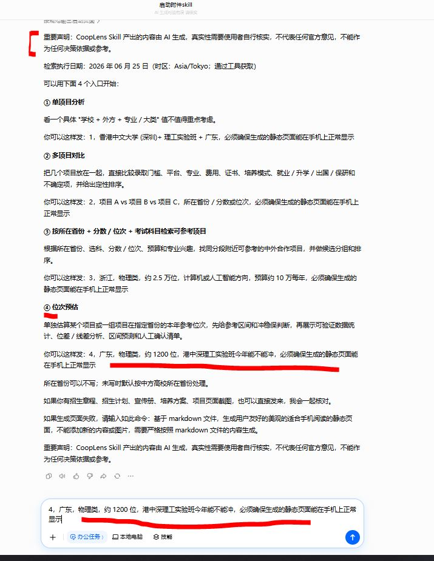
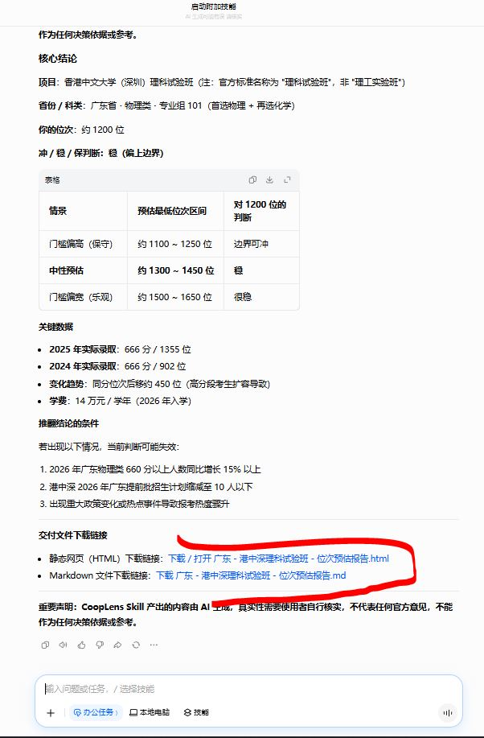
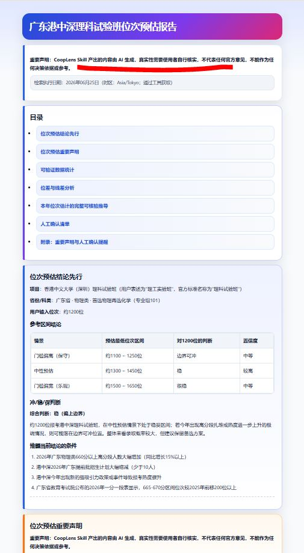
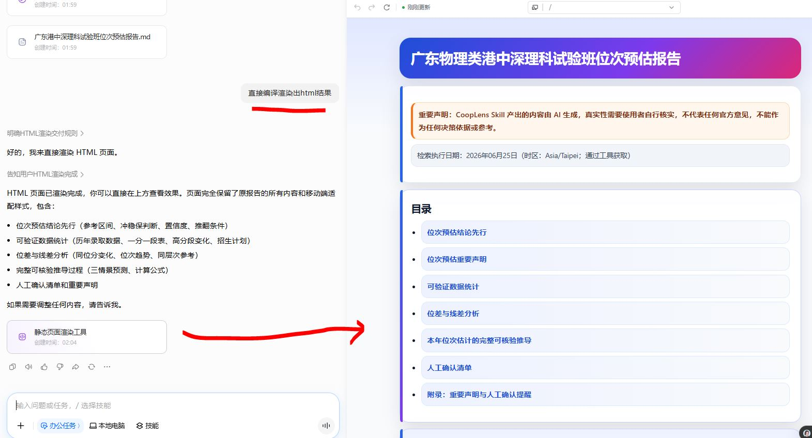

# CoopLens Skill 中外合作办学分析助手 skill

> [English version](https://github.com/c-narcissus/CoopLens#english-readme-cooplens-skill-chinese-foreign-cooperative-education-analysis-assistant-skill)

## 中文说明

CoopLens Skill 是一个面向高中生家长的中外合作办学项目分析 skill。它不只是回答“这个项目好不好”，而是围绕 **能不能报、拿什么证、交多少钱、怎么培养、未来升学就业前景如何、还有什么替代选择** 等家长真正关心的问题，生成的AI分析报告。

在此，将这个skill作为礼物送给Celeste Qu，luyuan Qu, 还有骆耀东，祝你们小孩考上称心如意的大学。

<p align="center">
  
</p>

> 重要声明：CoopLens Skill 产出的内容由 AI 生成，真实性需要使用者自行核实，不代表任何官方意见，不能作为任何决策依据或参考。
>
> Skill 包文件：[`cooplens-skill-1.0.15.zip`](./cooplens-skill-1.0.15.zip)

### 这不是普通高考评论区分析

CoopLens Skill：

- **不是只看学校名气**：会同时看中方平台、外方院校、专业匹配度、培养模式和同分段竞争项目。
- **不是只看当下就业热度**：会分析专业所属行业未来约 4-8 年的趋势、AI 对岗位和招聘的影响、学生该如何准备。
- **不是只给一个结论**：会写清“为什么这么判断”，以及哪些问题需要家长继续向学校确认。
- **不是只给聊天文字**：功能完成时默认交付 Markdown 和移动端 HTML 两个版本。

如果生成页面失败，或默认 HTML 在手机上阅读效果不够好，可以在继续输入：

“直接编译渲染出html结果”

或

“基于 markdown 文件，生成用户友好的美观的适合手机阅读的静态页面，不能添加新的内容或图片，需要严格按照 markdown 文件的内容生成。”

### 四个核心功能与分析亮点

#### 功能 1：单项目分析

用于分析一个具体中外合作办学项目，例如：

```text
1，南京师范大学 + 麦考瑞大学 + 计算机科学与技术 + 江苏
```

输出重点：

- 把“这个项目到底拿什么证、证书是否值得、是否必须出国”讲清楚，而不是只说学校名气。
- 把“专业白话解释、大学主要课程、高中能力要求、学习难点、适合孩子画像”纳入分析。
- 加入 **专业与行业前景分析**：行业规模、景气度、龙头企业变化、AI 对生产率和岗位结构的影响、未来约 4-8 年人才需求。
- 列出需要家长继续核对的问题，例如保研资格、转专业政策、外方学位名称、课程比例、毕业证书标注等。

#### 功能 2：多项目对比

用于横向比较多个项目，例如：

```text
使用 cooplens 的功能 2 对比：浙工大埃克塞特数据科学 VS 杭电圣光机计算机 VS 西南大学计算机（中外合作），浙江
```
输出重点：

- 不是简单说“A 学校比 B 学校强”，而是拆成 **录取门槛、证书、费用、培养、专业、未来就业、风险边界** 多维比较。
- 提供“适合谁 / 不适合谁”分析：例如预算有限、想 4+0、不想出国、重视学校平台、重视专业方向、计划海外升学等不同家庭的选择会不同。
- 把“城市产业环境、学校平台、外方认可度、专业方向”放在一起看。
- 关注 **新项目或首招项目**：必须给出大致位次参照范围、估算依据链和非预测边界。

#### 功能 3：按省份、位次和专业方向检索候选项目

用于从用户条件出发找项目，例如：

```text
3，浙江，物理类，约 2.5 万位，计算机或人工智能方向，预算约 10 万每年
```

输出重点：

- 不只找“名气大”的项目，还会找同分段附近、专业接近、费用接近、培养模式可接受的替代项目。
- 对没有历史招生数据的新项目，会大致估算并说明估算逻辑。

#### 功能 4：指定项目位次估算

用于判断某个省份、科类、位次下，指定项目今年是否值得冲，例如：

```text
4，广东，物理类，约1200位，港中深理工实验班今年能不能冲
```

输出重点：

- 先给出结论和建议，再解释依据。
- 结合历史录取位次、同省同层次项目、招生计划变化、专业组设置和当年热度，给出谨慎的位次参考区间。
- 对首招或数据不足项目，会使用同层次院校、相近专业、普通专业与合作办学专业的位次差等参照进行估算，并明确需要人工确认的边界。

### 报告生成流程

CoopLens Skill 采用“固定功能模板 -> 分模块生成 -> 证据核对 -> Markdown 汇总 -> 移动端 HTML 同源导出 -> 完成闸门检查”的流程。

1. **启动并读取规则**
2. **获取运行时日期**
3. **识别功能类型**
4. **分模块生成内容**
5. **核验关键数据**
6. **如涉及位次估算，整理位次区间、依据链和人工确认清单**
7. **生成 Markdown 主报告**
8. **从同一份 Markdown 生成移动端 HTML 静态页面**
9. **执行 HTML 语法、移动端渲染和交付闸门检查**
10. **如用户明确需要，再基于同一份 Markdown 生成 PDF 阅读版**

### 数据来源与人工核验机制

CoopLens Skill 的实际规则不是承诺“所有数据都已经核验”，也不是把材料统一包装成“权威来源”。它做的是：把关键数据的来源、证据边界、估算链条和人工确认事项尽量放到明面上，帮助家长继续逐项核对。

- **执行时先获取当前日期**
- **按任务检索最新可打开材料**
- **关键数字就近放来源**
- **证据不足时降级处理**
- **禁止兜底式来源承诺**
- **位次估算必须展示边界**
- **完成闸门检查**

### 如何在豆包“办公任务”模式中使用

#### S0. 加载 skill

点击输入框左下角，将默认的 **“快速”** 改为 **“办公任务”**。之后将 `cooplens-skill-1.0.15.zip` 拖入对话框，并输入：

```text
启动附件里的skill
```

#### S1A. 使用功能 1：单项目分析

```text
1，南京师范大学 + 麦考瑞大学 + 计算机科学与技术 + 江苏
```

skill 会单独分析这个项目，并在完成时提供 Markdown 和移动端 HTML 报告文件

#### S1B. 使用功能 2：多项目对比

```text
使用 cooplens 的功能 2 对比：浙工大埃克塞特数据科学 VS 杭电圣光机计算机 VS 西南大学计算机（中外合作），浙江
```

skill 会对比分析这些项目，并在完成时提供 Markdown 和移动端 HTML 报告文件

#### S1C. 使用功能 3：按条件检索候选项目

```text
3，浙江，物理类，约 2.5 万位，计算机或人工智能方向，预算约 10 万每年
```

skill 会寻找同分段附近可参考的中外合作项目，做候选分组和排序分析，并在完成时提供 Markdown 和移动端 HTML 报告文件

#### S1D. 使用功能 4：指定项目位次估算

```text
4，广东，物理类，约1200位，港中深理工实验班今年能不能冲
```

skill 会围绕指定项目估算大致位次区间，说明冲稳保判断、估算依据、关键不确定因素和需要人工确认的事项，并在完成时提供 Markdown 和移动端 HTML 报告文件

### 使用建议

如果手头有招生章程、招生计划、宣传册、培养方案、项目网页截图或省考试院目录，建议一并上传。这样 skill 可以把用户提供材料和公开来源一起核对，减少遗漏。

### 示例运行图

<table>
  <tr>
    <td align="center" width="50%"><br>S0 启动 skill</td>
    <td align="center" width="50%"><br>S1 执行功能 4</td>
  </tr>
  <tr>
    <td align="center" width="50%"><br>S2 功能 4 执行完毕</td>
    <td align="center" width="50%"><br>S3 查看 HTML 结果</td>
  </tr>
  <tr>
    <td align="center" colspan="2"><br>S4 HTML 渲染失败后，按提示追加提问并重新生成的结果</td>
  </tr>
</table>

---

## English README: CoopLens Skill Chinese-Foreign Cooperative Education Analysis Assistant skill

CoopLens Skill is a skill for helping parents of high-school students analyze Chinese-foreign cooperative undergraduate programs. It goes beyond “is this program good?” and focuses on the questions parents actually care about: **whether the student can apply, what credential they receive, how much it costs, how the student is trained, what the future prospects for further study and employment look like, and what alternatives are available**, generating AI analysis reports for program selection.

Here, this skill is offered as a gift to Celeste Qu, luyuan Qu, and Luo Yaodong. May your children be admitted to universities they are truly happy with.

<p align="center">
  
</p>

> Important notice: CoopLens Skill output is AI-generated. Users must independently verify factual accuracy. The output does not represent any official opinion and must not be used as a decision basis or official reference.
>
> Skill package: [`cooplens-skill-1.0.15.zip`](./cooplens-skill-1.0.15.zip)

### Not a Generic Gaokao Comment-Section Analysis

CoopLens Skill:

- **Does not only look at school reputation**: it reviews the Chinese institution, foreign partner, major fit, training model, and competing programs in the same score/rank band.
- **Does not only look at current job-market popularity**: it analyzes roughly 4-8 years of industry trends, AI impact on roles and hiring, and how the student should prepare.
- **Does not only give one conclusion**: it explains why a judgment is made and which questions parents should still confirm with the university.
- **Does not only produce chat text**: each completed task delivers Markdown and mobile HTML by default.

If the generated page fails, or if the default HTML is not comfortable to read on a phone, continue by entering:

“Directly compile and render the HTML result”

or

“Based on the Markdown file, generate a user-friendly, beautiful static page suitable for mobile reading. Do not add new content or images, and strictly follow the Markdown content.”

### Four Core Features and Analysis Highlights

#### Feature 1: Single-Program Analysis

Use this for one specific cooperative education program, for example:

```text
1, Nanjing Normal University + Macquarie University + Computer Science and Technology + Jiangsu
```

Output focus:

- Explain what credential the program leads to, whether it is valuable, and whether overseas study is required.
- Include plain-language major explanation, college courses, high-school preparation requirements, learning difficulty, and suitable-student profile.
- Add **major and industry outlook analysis**, including industry scale, business cycle, leading-company changes, AI impact on productivity and role structure, and roughly 4-8 years of talent demand.
- List questions parents should continue to verify, such as postgraduate recommendation eligibility, transfer-major policy, foreign degree title, course ratio, and diploma labeling.

#### Feature 2: Multi-Program Comparison

Use this to compare several programs side by side, for example:

```text
Use CoopLens feature 2 to compare: ZJUT-Exeter Data Science VS HDU-Saint Petersburg Electrotechnical University Computer Science VS Southwest University Computer Science (Chinese-foreign cooperation), Zhejiang
```

Output focus:

- Avoid simple “A is stronger than B” claims; compare across **admission threshold, credentials, costs, training, major, future employment, and risk boundaries**.
- Provide “fit / not fit” analysis, such as families with limited budgets, students who prefer 4+0, students who do not want to go abroad, families prioritizing school platform, families prioritizing major direction, or students planning overseas graduate study.
- Consider city industry environment, university platform, foreign partner recognition, and major direction together.
- Pay attention to **new or first-enrollment programs** and provide approximate rank references, evidence chains, and non-predictive boundaries.

#### Feature 3: Candidate Search by Province, Rank, and Major Direction

Use this to find candidate programs from user conditions, for example:

```text
3, Zhejiang, physics track, about rank 25,000, computer science or AI direction, budget about RMB 100,000 per year
```

Output focus:

- Search beyond famous programs and include alternatives with similar province/rank band, close major direction, similar cost, and acceptable training model.
- For programs without historical admission data, estimate cautiously and explain the logic.

#### Feature 4: Rank Estimation for a Specific Program

Use this to judge whether a student’s province, track, and rank can reasonably attempt a specific program, for example:

```text
4, Guangdong, physics track, about rank 1,200, can CUHK-Shenzhen Science and Engineering Experimental Class be attempted this year?
```

Output focus:

- Give the “reach / match / safer” judgment and suggestion first, then explain the evidence.
- Use historical admission ranks, same-province comparable programs, enrollment-plan changes, subject-group settings, and current popularity to provide a cautious rank reference range.
- For first-enrollment or data-limited programs, estimate using comparable institutions, similar majors, and rank gaps between ordinary and cooperative programs, while making the manual-verification boundaries clear.

### Report Generation Workflow

CoopLens Skill follows this workflow: fixed feature templates -> modular generation -> evidence checking -> Markdown consolidation -> mobile HTML same-source export -> completion gate check.

1. **Start and read rules**
2. **Get runtime date**
3. **Identify feature type**
4. **Generate modular content**
5. **Verify key data**
6. **If rank estimation is involved, organize the rank range, evidence chain, and manual-check list**
7. **Generate the Markdown master report**
8. **Generate the mobile HTML static page from the same Markdown**
9. **Run HTML syntax, mobile rendering, and delivery gate checks**
10. **If explicitly requested, generate a PDF reading version from the same Markdown**

### Source and Manual Verification Mechanism

CoopLens Skill does not promise that “all data has been verified,” nor does it package every material as an “authoritative source.” Its actual rule is to make key sources, evidence boundaries, estimation chains, and manual-check items visible so families can continue verifying them item by item.

- **Get the current date at runtime**
- **Search the latest openable materials by task**
- **Place sources near key numbers**
- **Downgrade when evidence is insufficient**
- **Block blanket source promises**
- **Rank estimation must show boundaries**
- **Run completion gates**

### How to Use in Doubao “Office Task” Mode

#### S0. Load the skill

Click the lower-left control in the input box, change the default **“Quick”** mode to **“Office Task”**, drag `cooplens-skill-1.0.15.zip` into the chat box, and enter:

```text
启动附件里的skill
```

#### S1A. Use Feature 1: Single-Program Analysis

```text
1, Nanjing Normal University + Macquarie University + Computer Science and Technology + Jiangsu
```

The skill analyzes this program and provides Markdown and mobile HTML report files when complete.

#### S1B. Use Feature 2: Multi-Program Comparison

```text
Use CoopLens feature 2 to compare: ZJUT-Exeter Data Science VS HDU-Saint Petersburg Electrotechnical University Computer Science VS Southwest University Computer Science (Chinese-foreign cooperation), Zhejiang
```

The skill compares these programs and provides Markdown and mobile HTML report files when complete.

#### S1C. Use Feature 3: Candidate Search

```text
3, Zhejiang, physics track, about rank 25,000, computer science or AI direction, budget about RMB 100,000 per year
```

The skill finds cooperative-education candidate programs near the same rank band, groups and ranks them, and provides Markdown and mobile HTML report files when complete.

#### S1D. Use Feature 4: Rank Estimation for a Specific Program

```text
4, Guangdong, physics track, about rank 1,200, can CUHK-Shenzhen Science and Engineering Experimental Class be attempted this year?
```

The skill estimates the approximate rank range for the specified program, explains the reach/match/safer judgment, estimation basis, key uncertainty factors, and items that should be manually confirmed, and provides Markdown and mobile HTML report files when complete.

### Usage Suggestion

If you have admission brochures, enrollment plans, promotional materials, training plans, program webpage screenshots, or provincial exam authority catalogs, upload them together. This allows the skill to cross-check user-provided materials with public sources and reduce omissions.

### Example Screenshots

<table>
  <tr>
    <td align="center" width="50%"><br>S0 Start the skill</td>
    <td align="center" width="50%"><br>S1 Run Feature 4</td>
  </tr>
  <tr>
    <td align="center" width="50%"><br>S2 Feature 4 complete</td>
    <td align="center" width="50%"><br>S3 View the HTML result</td>
  </tr>
  <tr>
    <td align="center" colspan="2"><br>S4 Result after adding a follow-up prompt when HTML rendering fails</td>
  </tr>
</table>
