# CoopLens Skill 中外合作办学分析助手 skill

> [English version](https://github.com/c-narcissus/CoopLens#english-readme-cooplens-skill-chinese-foreign-cooperative-education-analysis-assistant-skill)

## 中文说明

CoopLens Skill 是一个面向高中生家长的中外合作办学项目分析 skill。它不只是回答“这个项目好不好”，而是围绕 **能不能报、拿什么证、怎么培养、未来就业是否值得、还有什么替代选择** 等家长真正关心的问题，生成的AI分析报告。

<p align="center">
  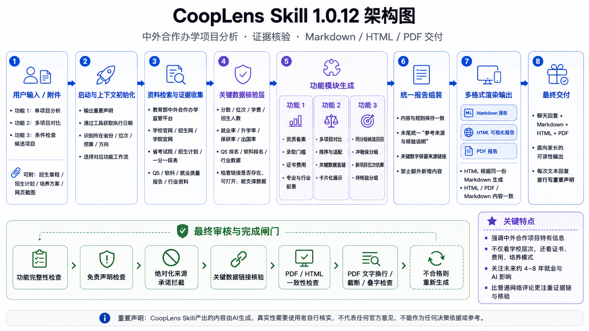
</p>

<p align="center">
  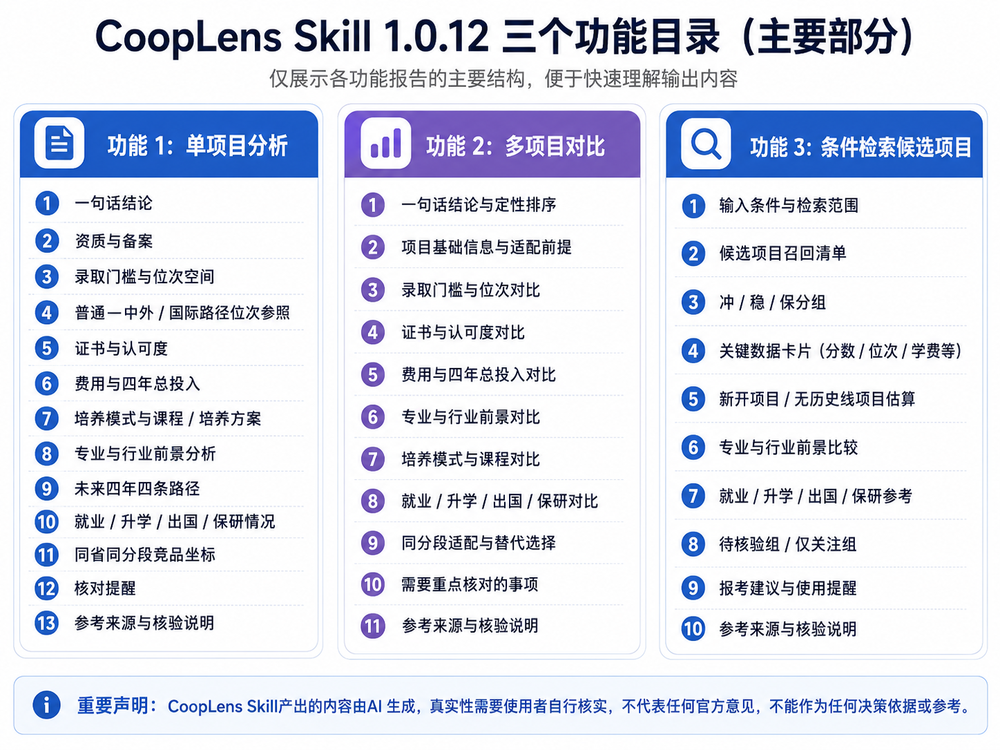
</p>

> 重要声明：CoopLens Skill 产出的内容由 AI 生成，真实性需要使用者自行核实，不代表任何官方意见，不能作为任何决策依据或参考。
>
> Skill 包文件：[`cooplens-skill-1.0.12.zip`](./cooplens-skill-1.0.12.zip)

### 这不是普通高考评论区分析

CoopLens Skill：

- **不是只看学校名气**：会同时看中方平台、外方院校、专业匹配度、培养模式和同分段竞争项目。
- **不是只看当下就业热度**：会分析专业所属行业未来约 4-8 年的趋势、AI 对岗位和招聘的影响、学生该如何准备。
- **不是只给一个结论**：会写清“为什么这么判断”，以及哪些问题需要家长继续向学校确认。
- **不是只给聊天文字**：功能完成时必须交付 Markdown、HTML、PDF 三个版本，内容保持一致。

如果觉得默认 HTML 效果不够好，可以在 Markdown 输出后继续要求：“基于 Markdown 格式输出，生成更美观的 HTML 页面”。

### 三个核心功能与分析亮点

#### 功能 1：单项目分析

用于分析一个具体中外合作办学项目，例如：

```text
1，南京师范大学 + 麦考瑞大学 + 计算机科学与技术 + 江苏
```

输出重点：

- 把“这个项目到底拿什么证、证书是否值得、是否必须出国”讲清楚，而不是只说学校名气。
- 把“专业白话解释、大学主要课程、高中能力要求、学习难点、适合孩子画像”纳入分析。
- 加入 **专业与行业前景分析**：行业规模、景气度、龙头企业变化、AI 对生产率和岗位结构的影响、未来约 4-8 年人才需求。
- 列出需要家长继续核对的问题，例如保研资格、转专业政策、外方学位名称、课程比例、毕业证书标注等。

#### 功能 2：多项目对比

用于横向比较多个项目，例如：

```text
使用 cooplens 的功能 2 对比：浙工大埃克塞特数据科学 VS 杭电圣光机计算机 VS 西南大学计算机（中外合作），浙江
```
输出重点：

- 不是简单说“A 学校比 B 学校强”，而是拆成 **录取门槛、证书、费用、培养、专业、未来就业、风险边界** 多维比较。
- 提供“适合谁 / 不适合谁”分析：例如预算有限、想 4+0、不想出国、重视学校平台、重视专业方向、计划海外升学等不同家庭的选择会不同。
- 把“城市产业环境、学校平台、外方认可度、专业方向”放在一起看。
- 关注 **新项目或首招项目**：必须给出大致位次参照范围、估算依据链和非预测边界。

#### 功能 3：按省份、位次和专业方向检索候选项目

用于从用户条件出发找项目，例如：

```text
3，浙江，物理类，约 2.5 万位，计算机或人工智能方向，预算约 10 万每年
```

输出重点：

- 不只找“名气大”的项目，还会找同分段附近、专业接近、费用接近、培养模式可接受的替代项目。
- 对没有历史招生数据的新项目，会大致估算并说明估算逻辑。

### 报告生成流程

CoopLens Skill 采用“固定功能模板 -> 分模块生成 -> 证据核验 -> Markdown 汇总 -> HTML/PDF 同源导出 -> 完成闸门检查”的流程。

1. **启动并读取规则**
2. **获取运行时日期**
3. **识别功能类型**
4. **分模块生成内容**
5. **核验关键数据**
6. **生成 Markdown 主报告**
7. **生成 HTML 可视化报告**
8. **生成 PDF 阅读版**
9. **执行完成闸门检查**

### 数据来源核验机制

CoopLens Skill 强调“先核验、再输出”，主要采用以下机制：

- **执行时先取当前日期**
- **优先使用官方/权威来源**
- **关键数字必须带来源链接**
- **关键数据链接最终核验**
- **智能体 / 执行器最终审核**

### 如何在豆包“办公任务”模式中使用

#### S0. 加载 skill

点击输入框左下角，将默认的 **“快速”** 改为 **“办公任务”**。之后将 `cooplens-skill-1.0.12.zip` 拖入对话框，并输入：

```text
启动附件里的skill
```

#### S1A. 使用功能 1：单项目分析

```text
1，南京师范大学 + 麦考瑞大学 + 计算机科学与技术 + 江苏
```

skill 会单独分析这个项目，并在完成时提供 Markdown、HTML 和 PDF 三个报告文件。

#### S1B. 使用功能 2：多项目对比

```text
使用 cooplens 的功能 2 对比：浙工大埃克塞特数据科学 VS 杭电圣光机计算机 VS 西南大学计算机（中外合作），浙江
```

skill 会对比分析这些项目，并在完成时提供 Markdown、HTML 和 PDF 三个报告文件。

#### S1C. 使用功能 3：按条件检索候选项目

```text
3，浙江，物理类，约 2.5 万位，计算机或人工智能方向，预算约 10 万每年
```

skill 会寻找同分段附近可参考的中外合作项目，做候选分组和排序分析，并在完成时提供 Markdown、HTML 和 PDF 三个报告文件。

### 使用建议

如果手头有招生章程、招生计划、宣传册、培养方案、项目网页截图或省考试院目录，建议一并上传。这样 skill 可以把用户提供材料和公开来源一起核对，减少遗漏。

### 示例运行图

<table>
  <tr>
    <td align="center" width="25%">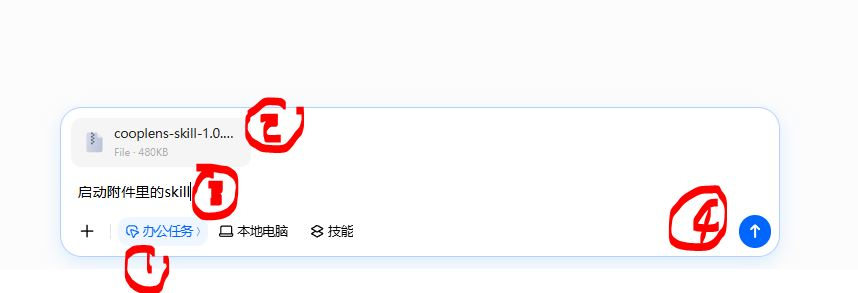<br>S0 加载 skill</td>
    <td align="center" width="25%">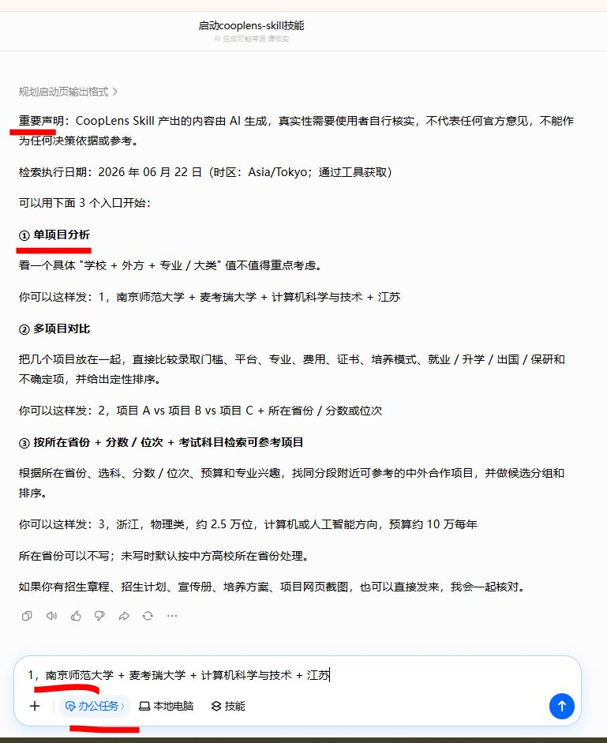<br>S1A 执行功能 1</td>
    <td align="center" width="25%">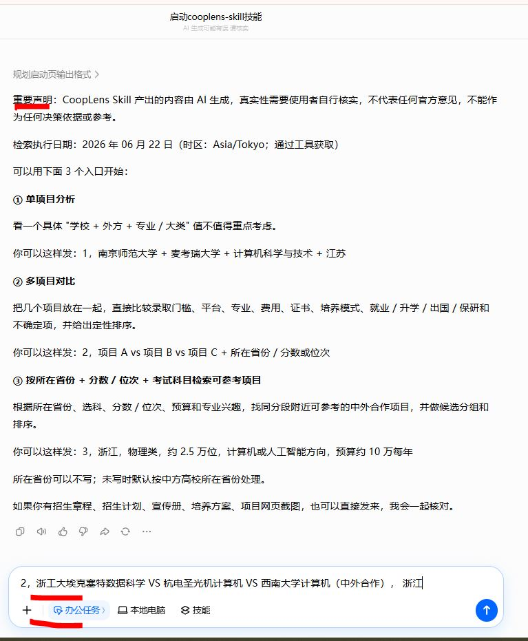<br>S1B 执行功能 2</td>
    <td align="center" width="25%">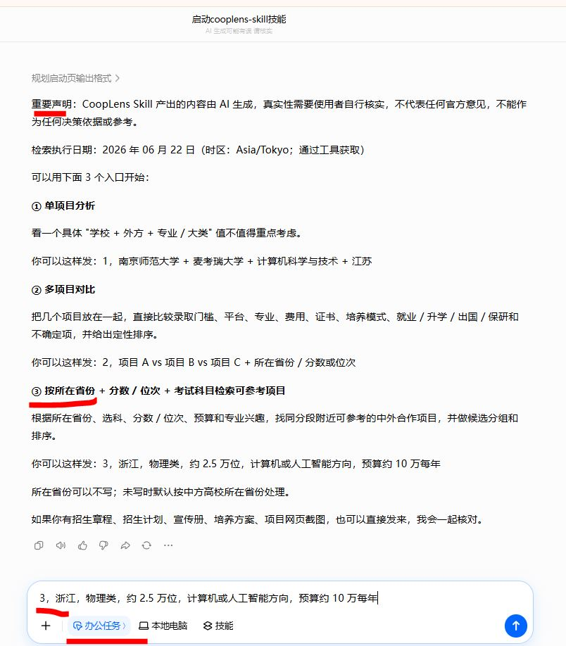<br>S1C 执行功能 3</td>
  </tr>
</table>

<table>
  <tr>
    <td align="center" width="33%">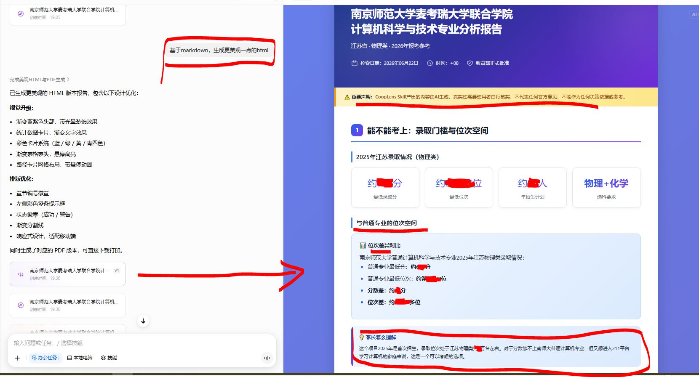<br>功能 1 HTML 输出</td>
    <td align="center" width="33%">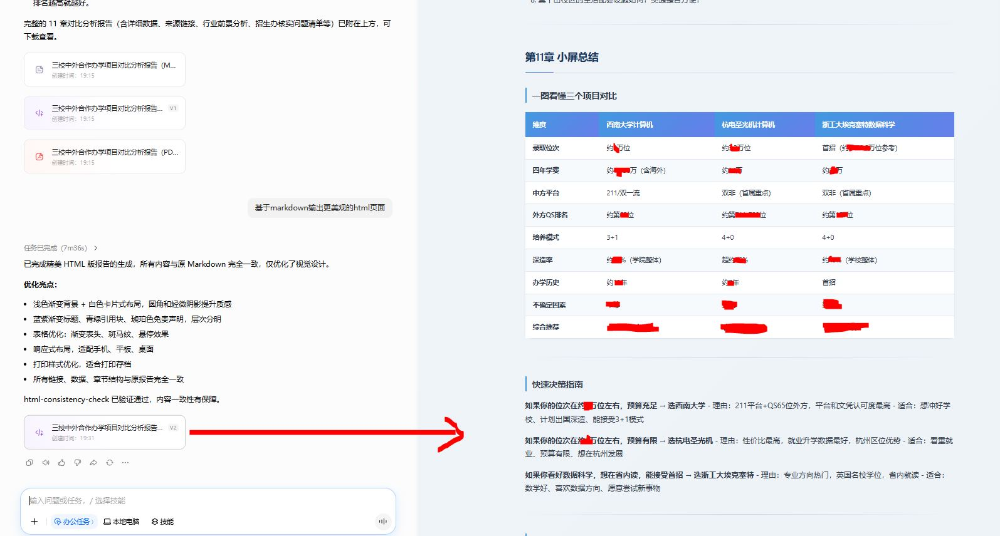<br>功能 2 HTML 输出</td>
    <td align="center" width="33%">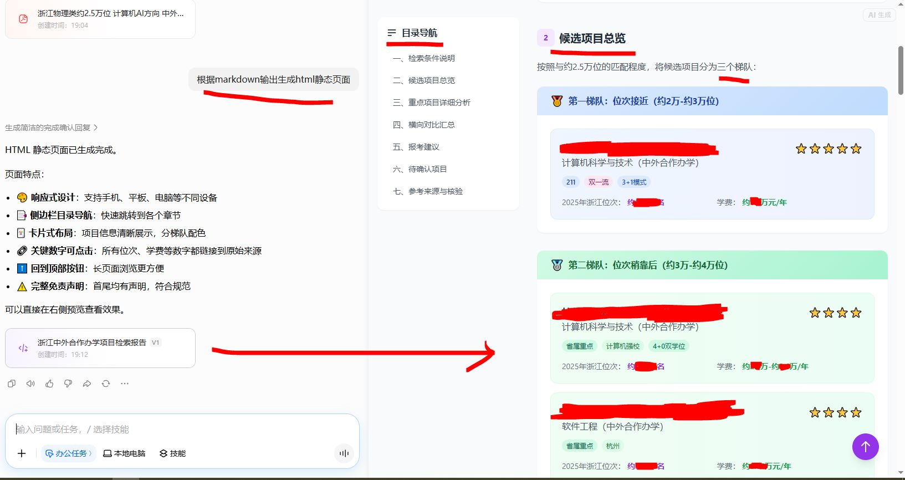<br>功能 3 HTML 输出</td>
  </tr>
</table>

<table>
  <tr>
    <td align="center" width="33%">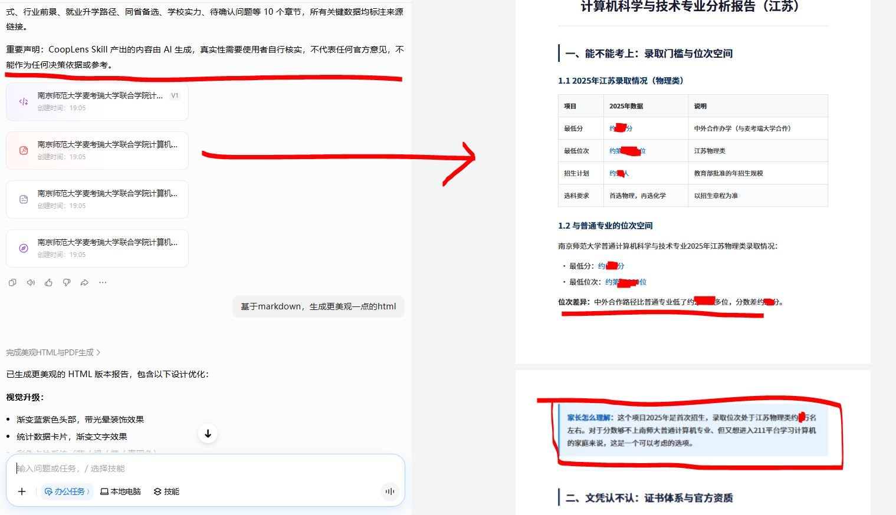<br>功能 1 PDF 输出</td>
    <td align="center" width="33%">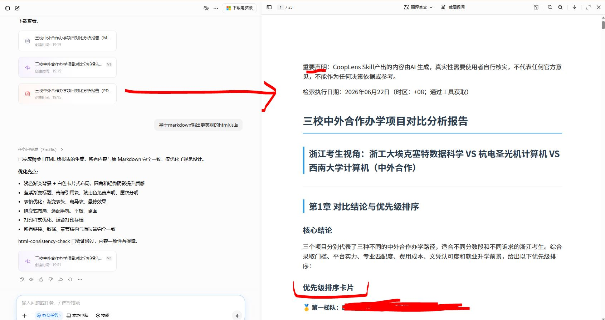<br>功能 2 PDF 输出</td>
    <td align="center" width="33%">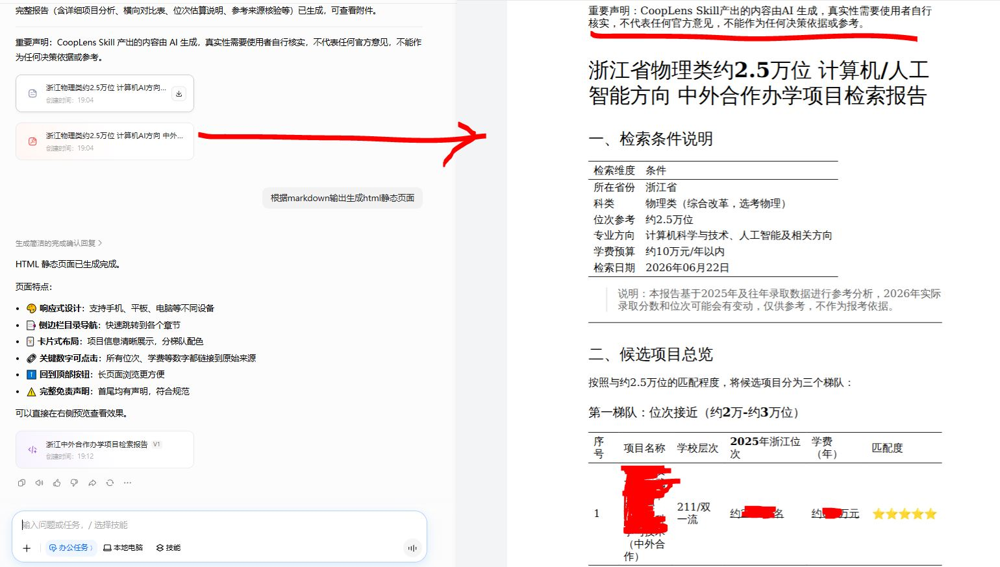<br>功能 3 PDF 输出</td>
  </tr>
</table>

---

## English README: CoopLens Skill Chinese-Foreign Cooperative Education Analysis Assistant skill

CoopLens Skill is a skill for helping parents of high-school students analyze Chinese-foreign cooperative undergraduate programs. It goes beyond “is this program good?” and focuses on the questions parents actually care about: **whether the student can apply, what credential they receive, how the program is delivered, whether the future employment path is worth it, and what alternatives are available**, generating AI analysis reports for program selection.

<p align="center">
  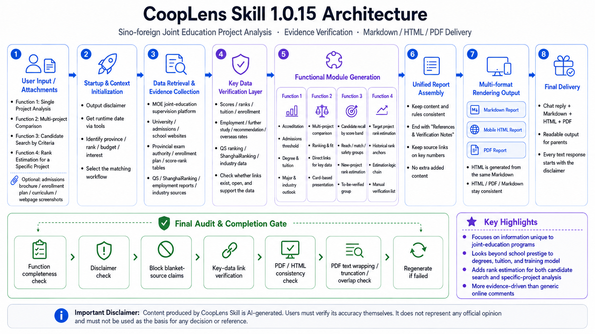
</p>

<p align="center">
  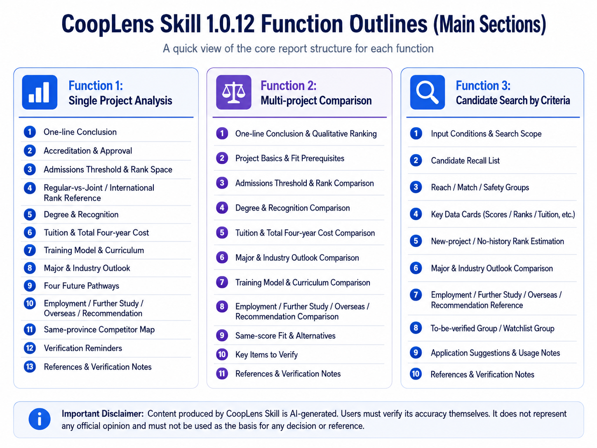
</p>

> Important notice: CoopLens Skill output is AI-generated. Users must independently verify factual accuracy. The output does not represent any official opinion and must not be used as a decision basis or official reference.
>
> Skill package: [`cooplens-skill-1.0.12.zip`](./cooplens-skill-1.0.12.zip)

### Not a Generic Gaokao Comment-Section Analysis

CoopLens Skill:

- **Does not only look at school reputation**: it reviews the Chinese institution, foreign partner, major fit, training model, and competing programs in the same score/rank band.
- **Does not only look at current job-market popularity**: it analyzes roughly 4-8 years of industry trends, AI impact on roles and hiring, and how the student should prepare.
- **Does not only give one conclusion**: it explains why a judgment is made and which questions parents should still confirm with the university.
- **Does not only produce chat text**: each completed task should deliver Markdown, HTML, and PDF versions with consistent content.

If the default HTML page is not polished enough, continue after the Markdown output with: “Based on the Markdown output, generate a prettier HTML page.”

### Three Core Features and Analysis Highlights

#### Feature 1: Single-Program Analysis

Use this for one specific cooperative education program, for example:

```text
1, Nanjing Normal University + Macquarie University + Computer Science and Technology + Jiangsu
```

Output focus:

- Explain what credential the program leads to, whether it is valuable, and whether overseas study is required.
- Include plain-language major explanation, college courses, high-school preparation requirements, learning difficulty, and suitable-student profile.
- Add **major and industry outlook analysis**, including industry scale, business cycle, leading-company changes, AI impact on productivity and role structure, and roughly 4-8 years of talent demand.
- List questions parents should continue to verify, such as postgraduate recommendation eligibility, transfer-major policy, foreign degree title, course ratio, and diploma labeling.

#### Feature 2: Multi-Program Comparison

Use this to compare several programs side by side, for example:

```text
Use CoopLens feature 2 to compare: ZJUT-Exeter Data Science VS HDU-Saint Petersburg Electrotechnical University Computer Science VS Southwest University Computer Science (Chinese-foreign cooperation), Zhejiang
```

Output focus:

- Avoid simple “A is stronger than B” claims; compare across **admission threshold, credentials, costs, training, major, future employment, and risk boundaries**.
- Provide “fit / not fit” analysis, such as families with limited budgets, students who prefer 4+0, students who do not want to go abroad, families prioritizing school platform, families prioritizing major direction, or students planning overseas graduate study.
- Consider city industry environment, university platform, foreign partner recognition, and major direction together.
- Pay attention to **new or first-enrollment programs** and provide approximate rank references, evidence chains, and non-predictive boundaries.

#### Feature 3: Candidate Search by Province, Rank, and Major Direction

Use this to find candidate programs from user conditions, for example:

```text
3, Zhejiang, physics track, about rank 25,000, computer science or AI direction, budget about RMB 100,000 per year
```

Output focus:

- Search beyond famous programs and include alternatives with similar province/rank band, close major direction, similar cost, and acceptable training model.
- For programs without historical admission data, estimate cautiously and explain the logic.

### Report Generation Workflow

CoopLens Skill follows this workflow: fixed feature templates -> modular generation -> evidence verification -> Markdown consolidation -> HTML/PDF same-source export -> completion gate check.

1. **Start and read rules**
2. **Get runtime date**
3. **Identify feature type**
4. **Generate modular content**
5. **Verify key data**
6. **Generate the Markdown master report**
7. **Generate the HTML visual report**
8. **Generate the PDF reading version**
9. **Run the completion gate check**

### Source Verification Mechanism

CoopLens Skill emphasizes “verify first, then output” through these mechanisms:

- **Get the current date at execution time**
- **Prefer official and authoritative sources**
- **Attach source links to key numbers**
- **Run final verification on key data links**
- **Use agent/executor final review**

### How to Use in Doubao “Office Task” Mode

#### S0. Load the skill

Click the lower-left control in the input box, change the default **“Quick”** mode to **“Office Task”**, drag `cooplens-skill-1.0.12.zip` into the chat box, and enter:

```text
启动附件里的skill
```

#### S1A. Use Feature 1: Single-Program Analysis

```text
1, Nanjing Normal University + Macquarie University + Computer Science and Technology + Jiangsu
```

The skill analyzes this program and provides Markdown, HTML, and PDF report files when complete.

#### S1B. Use Feature 2: Multi-Program Comparison

```text
Use CoopLens feature 2 to compare: ZJUT-Exeter Data Science VS HDU-Saint Petersburg Electrotechnical University Computer Science VS Southwest University Computer Science (Chinese-foreign cooperation), Zhejiang
```

The skill compares these programs and provides Markdown, HTML, and PDF report files when complete.

#### S1C. Use Feature 3: Candidate Search

```text
3, Zhejiang, physics track, about rank 25,000, computer science or AI direction, budget about RMB 100,000 per year
```

The skill finds cooperative-education candidate programs near the same rank band, groups and ranks them, and provides Markdown, HTML, and PDF report files when complete.

### Usage Suggestion

If you have admission brochures, enrollment plans, promotional materials, training plans, program webpage screenshots, or provincial exam authority catalogs, upload them together. This allows the skill to cross-check user-provided materials with public sources and reduce omissions.

### Example Screenshots

<table>
  <tr>
    <td align="center" width="25%"><br>S0 Load skill</td>
    <td align="center" width="25%"><br>S1A Run feature 1</td>
    <td align="center" width="25%"><br>S1B Run feature 2</td>
    <td align="center" width="25%"><br>S1C Run feature 3</td>
  </tr>
</table>

<table>
  <tr>
    <td align="center" width="33%"><br>Feature 1 HTML output</td>
    <td align="center" width="33%"><br>Feature 2 HTML output</td>
    <td align="center" width="33%"><br>Feature 3 HTML output</td>
  </tr>
</table>

<table>
  <tr>
    <td align="center" width="33%"><br>Feature 1 PDF output</td>
    <td align="center" width="33%"><br>Feature 2 PDF output</td>
    <td align="center" width="33%"><br>Feature 3 PDF output</td>
  </tr>
</table>
